# Watching U

> Django + Vanilla.js

#### :punch: ​팀원

* 윤혜윤 (팀장)
  * ERD 모델링
  * 기본 및 추가 기능 구현
  * API 활용 (TMDB, youtube)
  * 크롤링 (naver movie)
  * Wordcloud
  * PPT 및 영상 제작
* 박유정 (팀원)
  * 기본 기능 구현
  * 홈 페이지 디테일 구현
  * 홈 페이지 구상
  * 일정 관리
  * 시연 및 발표 촬영
  * 서비스 배포

#### :punch: ​계획 및 일정

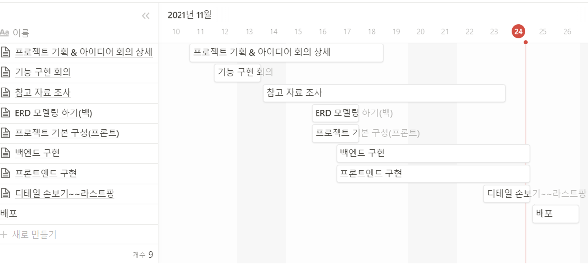

#### :punch: PJT 목표 및 실제 구현 개요

* 영화 정보 제공 (관리자 권한)
* 커뮤니티 (user 리뷰, 댓글 CRUD)
* 추천 알고리즘 
* 회원가입, 로그인, 로그아웃
* 리뷰 좋아요
* 영화 보고싶어요, 별점
* 검색 (영화 제목, 감독 필터)
* 워드클라우드
* 별점 분포 그래프
* 총 영화 감상 시간 
* 예고편
* Oauth (google, github)
* 반응형 웹

#### :punch: ERD

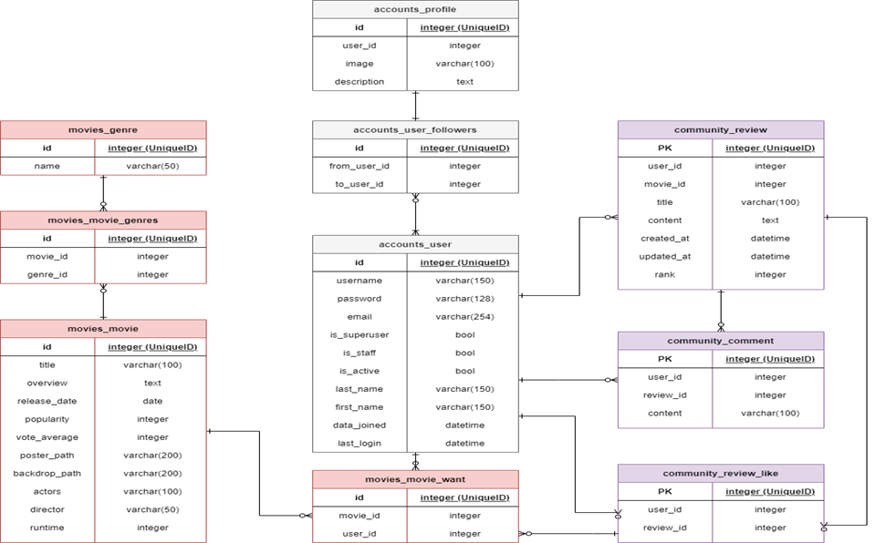

#### :punch: ​프로젝트 기능 및 구현

> Home

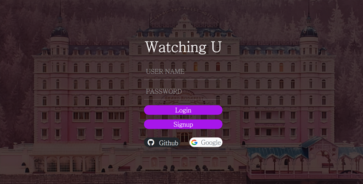

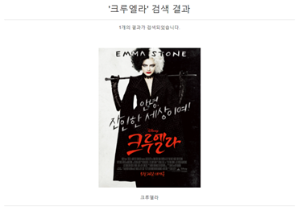

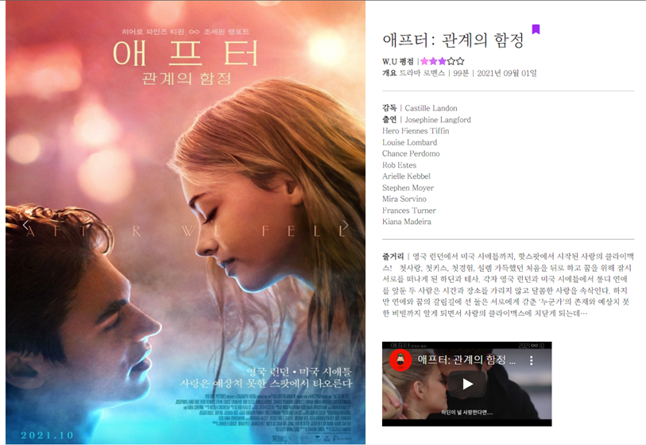

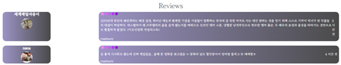

* 영화 제목 및 감독 이름 검색 및 결과
* 전체 영화 목록 (TMDB API)
* 보고싶어요 버튼
* User들의 평균 평점 계산
* 영화 예고편 (Youtube API)
* User 리뷰 목록

> Community

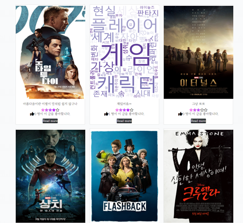

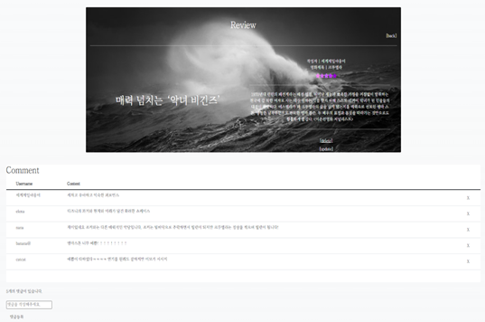

* 전체 유저들의 영화 평가 리뷰 
* 리뷰 좋아요 버튼
* 마우스 오버 시 해당 영화의 키워드들을 한 눈에 파악할 수 있는 워드클라우드
* 리뷰 상세 페이지와 댓글

> My page

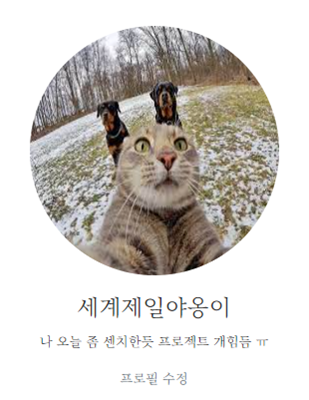

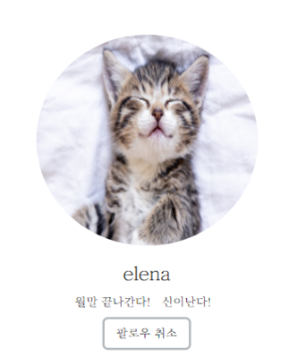

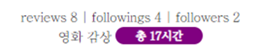

* 프로필 수정 (프로필 사진 및 상태메시지)

* 팔로우 기능

* 리뷰, 팔로우, 팔로잉 수

* 평가한 영화의 총 runtime

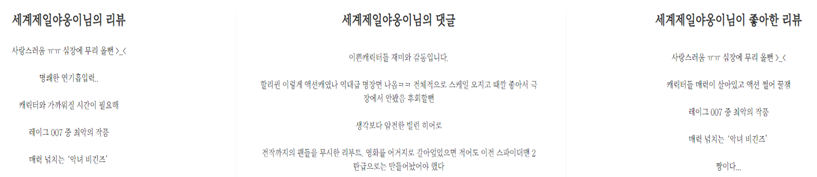

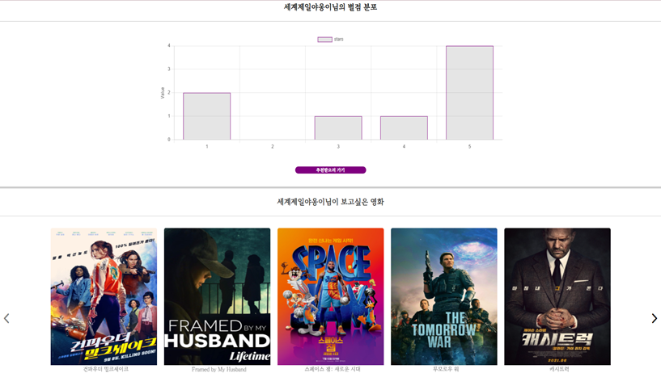

* 평가 리뷰글, 댓글, 좋아한 리뷰 목록

* User가 평가한 별점 분포

* User가 보고싶어요를 누른 영화 목록 

> Recommend

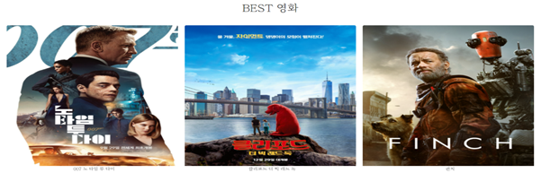

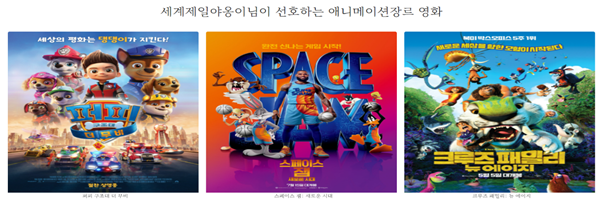

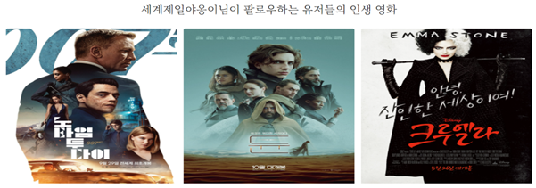

1. 모든 User들이 보고싶어요를 많이 누른 영화 순

(모든 유저)

2. User가 가장 높은 별점을 준 영화의 장르들 중 랜덤으로 뽑은 장르의 영화 목록

(평가를 했을 시)

3. User의 팔로우들이 가장 높은 별점을 준 영화 목록

(팔로우를 했을 시)

# 후기

팀이 있었기에 기능 구현에 필요한 것들을 함께 학습하는 것에 대한 기대감이 있었습니다. 처음에 장고와 뷰를 하기로 하였으나 초반에 장고와 바닐라 자바스크립트로 바꿨고 프론트와 백엔드에 명확한 경계가 나뉘지 않는 이 선택이 오히려 학습하기에 개인적으로 잘 한 선택이라고 생각되어집니다. 가장 좋았던점은 개발 역량 향상이 있었음을 느낄  수 있었습니다. 프로젝트를 직접하고 홈페이지를 작성하면서 모르는 부분을 구글링해서 채우고 구현해보며 CSS와 HTML , JS 에 좀더 깊이 있게 알게 되었던 것 같습니다. 또한 이 과정에서 제가 얼마나 CSS와 JS를 얕게 알고 있었는지 체감 할 수있었으며 이러한 부분을 향후 더욱 개선하면 좋을 것이란 생각이 들었습니다. 역시 실습이 가장 실력이 느는데 빠른 길 인것 같고 학습한 것들을 곧 까먹을 것이란 걸 알기에 정리가 꼭 필요하다는 생각을 하였습니다.
